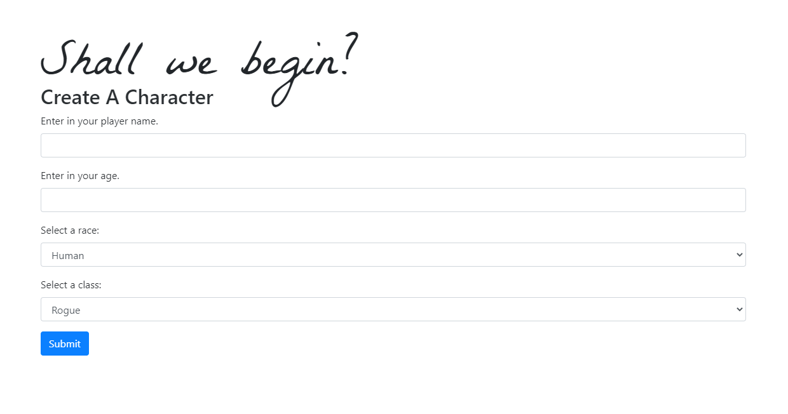

# Jasmine Game

#### Table of Contents
  * [Description](#Description)
  * [Installation](#Installation)
  * [Screenshots](#Screenshots)
  * [Credits](#Credits)
  * [License](#License)

  ## Live Site
Click [here](https://team-jasmine-rpg.herokuapp.com/) to see the live deployment.
  
## Description
Welcome to the JasminRPG. This website was developed to to be a rpg site. Once on the site you will be able to create a character. Once that character is created it is put on an adventure. While on the adventure the player will get prompts to enter text as they play. You will be provided with several choices of skills, spells,  active powers and wearable equipment such as armors and weapons. The Fight Pit page will give you an opppurtunity to battle against other characters. You will be able to battle using XP points to fight against your enemy.  

 
## Installation
#### Technologies Used
* HTML
* JavaScript
* [MySQL](https://www.mysql.com/) & [MySQL Workbench](https://www.mysql.com/products/workbench/)
* [Bootstrap](https://getbootstrap.com/)
* [Node](https://nodejs.org/en/) and [npm](https://www.npmjs.com/package/npm)
* [Visual Studio Code](https://code.visualstudio.com/)
* [cmder](https://cmder.net/)

#### Steps
1. * Start by entering the following in your terminal: `Git clone `

2. * Change directory to `Jasmine-RPG` and enter `npm install` into your terminal. This will install all package dependencies.

3. * Add node_modules to .gitignore.

4. * Create a `config.js` file based on the template [here](./config/config.js.example).
    * If file `config.js` is created in another location other than the parent folder, remember to update `server.js` `const credentials = require('./config')` with the new relative path.
    * Replace `<ID>` in the `user` and `password` fields in `config.js` with the credential information for the database.

5. * Copy Database and Table setup from `./models/schema.sql`
        * Paste into MySQL Workbench and execute.

* Start the application by running `npm start`

## Screenshots
#### Create Character

#### View Characters
 

#### Adventures Page

## Built With
HTML
JavaScript
Jquery 
CSS 
MYSQL

## Credits
JS/MYSQL/- Calvin Freese & Billy Sheehan
HTML/Page Structure-Foos Mahamud
UI/UX- Liban Esse

## License

[License](LICENSE)
MIT &copy; 2020 Team Jasmine (Foos Mahamud, Liban Esse, Billy Sheehan, and Calvin Freese)
